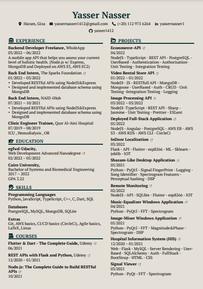

# Yasser Nasser Ahmed

- A Senior Systems & Biomedical Engineering <a href="http://eng.cu.edu.eg/ar/">@Faculty of Engineering Cairo University</a>
- Interested in Back-End Development, Databases
- Self-Motivated to learn more.

## 📝 Resume

--------

## 🛠 Languages & Technologies

<code></code>
<code></code>
<code></code>
<code></code>
<code></code>
<code></code>
<code></code>
<code></code>
<code></code>
<code></code>

